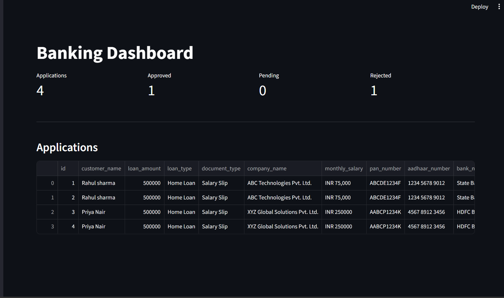
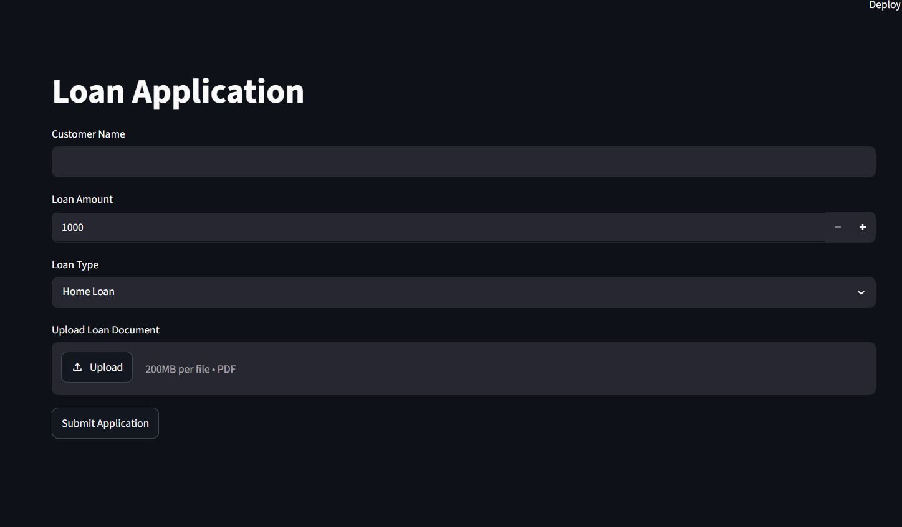
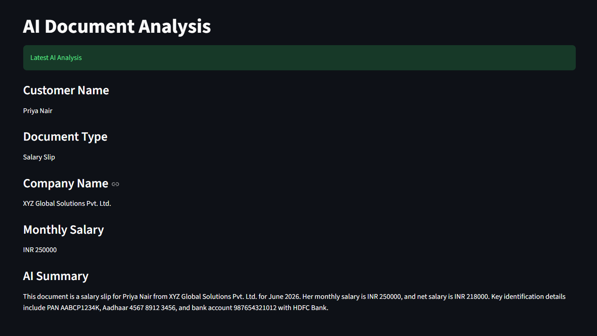
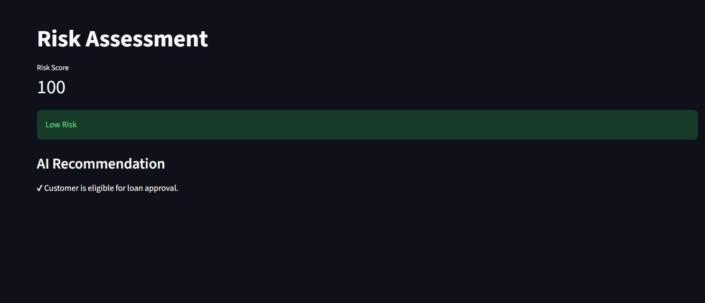
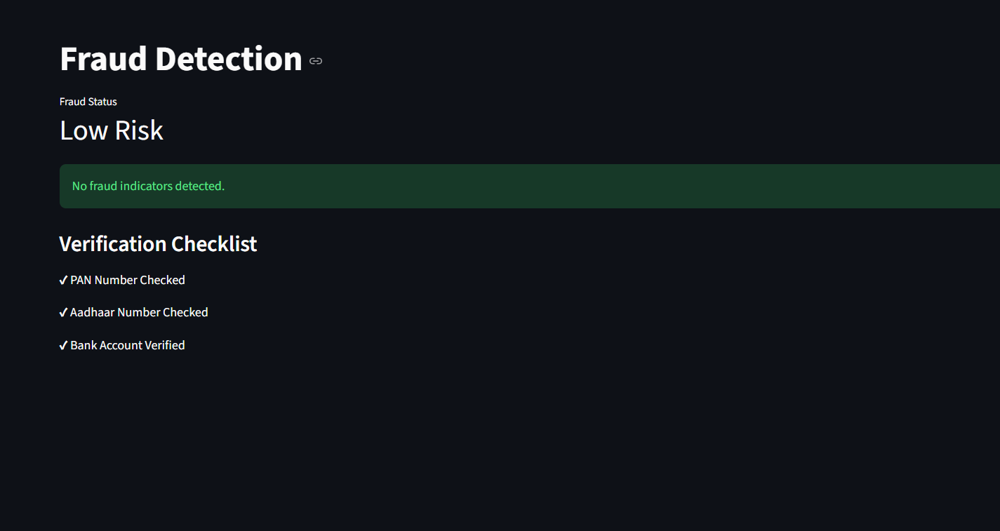
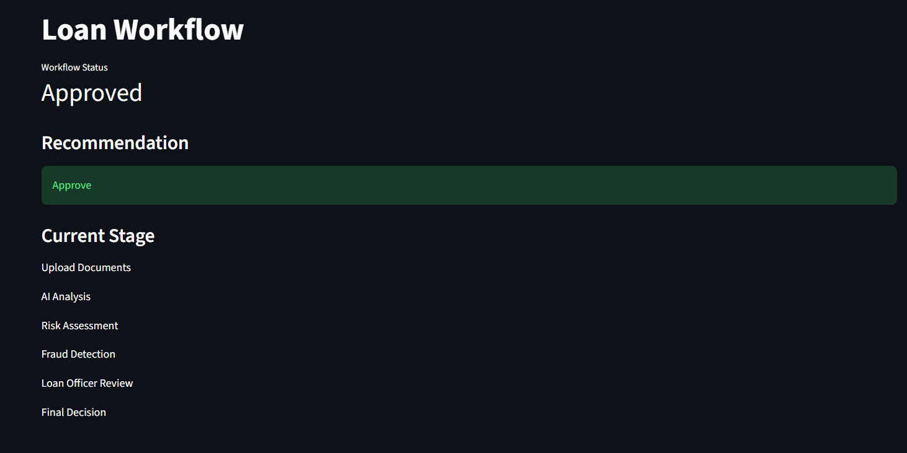
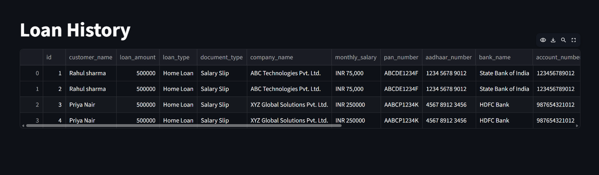
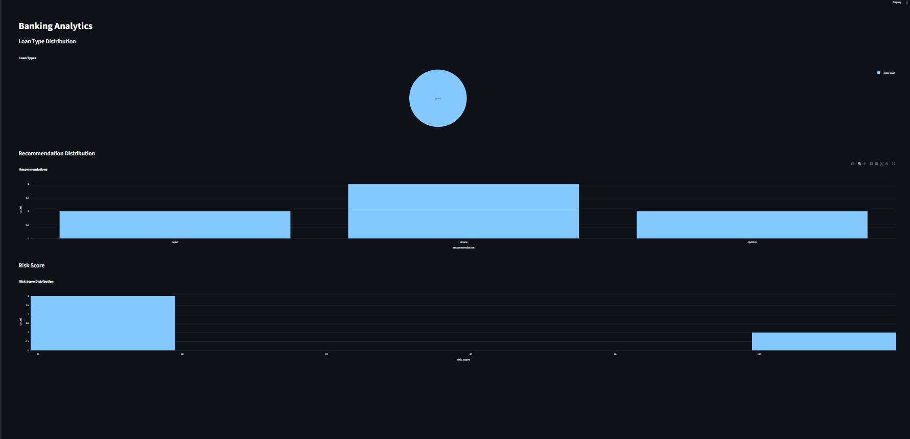

#  Enterprise Banking Loan Processing & Fraud Intelligence Agent

An AI-powered banking workflow automation system built using **Python**, **Streamlit**, **Google Gemini AI**, and **SQLite**.

The application automates the complete loan processing workflow by extracting information from uploaded loan documents, assessing customer risk, detecting fraud, and recommending loan approval decisions.

---

#  Features

-  AI Document Analysis using Google Gemini AI
-  PDF Document Text Extraction
-  Loan Risk Assessment
-  Fraud Detection
-  Intelligent Workflow Automation
-  SQLite Database Integration
-  Loan History
-  Banking Analytics Dashboard

---

#  Tech Stack

- Python
- Streamlit
- Google Gemini AI
- SQLite
- PyMuPDF
- Pandas
- Python Dotenv

---

#  Project Structure

```
Enterprise-Banking-Agent/
│
├── agents/
├── database/
├── pages/
├── uploads/
├── utils/
│
├── app.py
├── requirements.txt
├── README.md
└── .gitignore
```

---

#  Loan Processing Workflow

```
Upload Loan Documents
        ↓
AI Document Analysis
        ↓
Risk Assessment
        ↓
Fraud Detection
        ↓
Workflow Automation
        ↓
Loan Approval Decision
```

---

#  Workflow Outcomes

-  Approved
-  Manual Review
-  Rejected

---

#  Installation

Clone the repository

```bash
git clone <your-repository-url>
```

Navigate to the project

```bash
cd Enterprise-Banking-Agent
```

Install dependencies

```bash
pip install -r requirements.txt
```

Create a `.env` file

```env
GOOGLE_API_KEY=YOUR_API_KEY
```

Run the application

```bash
streamlit run app.py
```

---

#  Screenshots

- Dashboard

- Loan Application

- AI Analysis

- Risk Assessment

- Fraud Detection

- Workflow

- Loan History

- Analytics



---

#  Author

**Sudharsan S**

Built as an AI-powered banking workflow automation project using Streamlit and Google Gemini AI.

# URL

https://enterprise-banking-agent-qnj6ck8crkersmh3znpcbj.streamlit.app/